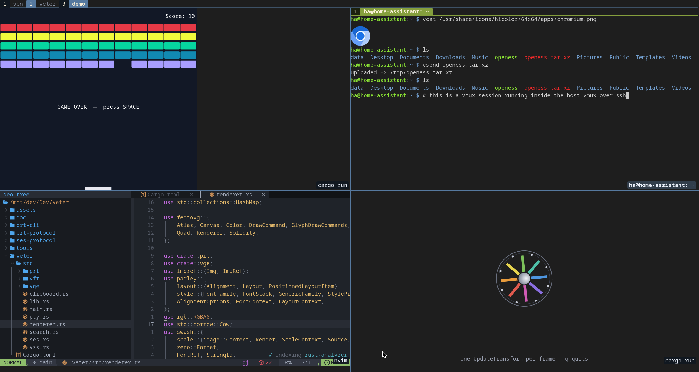

# Veter



Veter (Russian: *ветер*, "wind") is a GUI terminal emulator built around a family of custom protocols that all ride a single PTY:

- **PRT** — Portal Extension. Carves the terminal grid into recursive sub-terminals (multiplexer panes, PiP log views, scrollback-anchored snapshots). See [`doc/portal-extension.md`](doc/portal-extension.md).
- **VGE** — Vector Graphics Extension. Vector primitives, text, and images rendered directly inside the terminal grid. See [`doc/vector-graphics-extension.md`](doc/vector-graphics-extension.md).
- **VFT** — File Transfer Extension. Move file bytes between a client running in the terminal and the host, in either direction, over the same PTY. *(WIP, v0.)* See [`doc/file-transfer-extension.md`](doc/file-transfer-extension.md).
- **VSS + SES** — Session layer. `vsd` keeps a session alive across renderer disconnects (SSH survivability), shipping its state as a VSS binary snapshot on attach; SES is the small `vmux` ↔ `vsd` control channel. See [`doc/session-manager.md`](doc/session-manager.md) and [`doc/session-extension.md`](doc/session-extension.md).

Every protocol is framed as APC envelopes (`ESC _ … ESC \`) so they pass cleanly through pipes, `script(1)`, and other terminal tooling.

## Tools

| Crate | Purpose |
|---|---|
| `veter` | The GUI terminal (winit + glutin + femtovg + parley + swash). |
| `veter-host` | GUI-free host engines (vt100 + PRT + VGE + VFT + SES + VSS) shared by the `veter` GUI and the `vsd` daemon. |
| `vmux` | Terminal multiplexer that runs *inside* `veter`, using PRT for panes and VGE for chrome. Default prefix `Ctrl+Space`. |
| `vcat` | Display images inside a VGE-aware terminal. |
| `vplay` | Interactive image and video viewer for VGE-aware terminals. |
| `vsend`, `vrecv` | Upload a local file to / pull a host-side file back from a VFT-aware terminal. |
| `vsd` | Persistent session daemon — holds session state across renderer disconnects. |
| `vssh` | SSH wrapper that keeps the veter tools fresh on remote hosts. |
| `vge-cli`, `prt-cli` | Emit raw protocol envelopes for manual testing. |
| `vge-protocol`, `prt-protocol`, `vft-protocol`, `ses-protocol`, `vss-protocol` | Pure wire-format crates — APC parser, codec, encoders. No state, no rendering. |
| `vge-render` | Shared client-side image-rendering helpers (used by `vcat`, `vplay`). |
| `vt100` | Vendored fork of the `vt100` parser (adds `clear_scrollback`, resize helpers, and binary snapshot/restore). |
| `breakout`, `spinner` | VGE demos. |

## Build

Cargo workspace, edition 2024 (the vendored `vt100` fork stays on 2021).

```sh
cargo build --release
cargo run -p veter
```

## Install

```sh
make install      # veter + vcat, vplay, vmux, vsend, vrecv, vsd, vssh to $PREFIX/bin (default ~/.local) plus a desktop entry
make uninstall
```

Override `PREFIX=...` to retarget. `make install-remote-<arch>` cross-compiles a musl build and installs it to `$REMOTE`.

## Tests

```sh
cargo test                  # whole workspace
cargo test -p prt-protocol  # one crate
```
